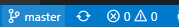
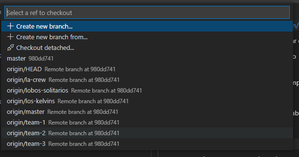
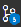
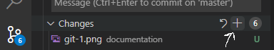
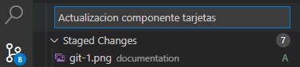
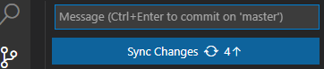

Cada equipo luchará por ser uno los mejores diseñadores web de la historia, creando un clon de la web **Netflix**. Para ello, crearemos componentes muy pequeños de manera aislada, para, en un futuro, poder juntarlos todos dentro de una web pública.

- **Web Original:** https://www.netflix.com/es/
- **Clon:** https://cloneflix-ashen.vercel.app/#/
- **Doc de Git:** https://rogerdudler.github.io/git-guide/index.es.html
- **Doc de React:** https://es.reactjs.org/docs/hello-world.html
- **Doc de Html, Css:** https://www.w3.org/Style/Examples/011/firstcss.es.html

## 🚀 Primeros Pasos

**1**. Descargar Git y Node.js para Windows

> https://gitforwindows.org/

> https://nodejs.org/es/

**2**. Descargar Visual Studio Code para Windows

> https://code.visualstudio.com/

**3**. Clonar este proyecto a donde queramos en nuestro ordenador

- Abrir consola de git _(git bash)_ en la ruta en la que queramos guardar el proyecto

  > git clone https://github.com/victor-font-webbeds/netflix.git

**4**. Abrir Visual Studio Code e importar el proyecto que hemos clonado

- Arriba a la izquierda en Archivo > Añadir Carpeta
- Seleccionaremos la carpeta _netflix_ dentro de nuestro proyecto

**5**. Abrir terminal de Visual Studio e importar todas las dependencias externas

- Menú superior -> Terminal -> Nueva Terminal
- Abajo veremos una terminal. Clicar dentro de la terminal y ejecutar el comando:

  > npm i

  (este proceso puede tardar un poco)

## 💻 Ejecutar el proyecto

**1**. Haber configurado todo tal como explica el apartado **Primeros Pasos**

**2**. Ejecutar el proyecto

- Abajo a la izquierda, clicar donde pone _master_.  
  
- Arriba nos saldrá un recuadro, donde deberemos elegir la rama del equipo al que pertenecemos.
  
  Ej.: si pertenecemos al equipo **team-1**, clicar donde pone **origin/team-1**
- Abrir terminal en Visual Studio Code y clicar dentro
  > npm run storybook

## ✏️ Diseñar un componente

**1.** Posicionarnos en la carpeta del componente en cuestión

Ej.: si desarrollamos el componente Card, ir a la carpeta _src_ > _card_ > _card_nombreDelEquipo_

**2.** Realizar los cambios que queramos dentro del componente y guardar todos los archivos modificados.
**3.** Subir los cambios a nuestra rama

- Seleccionar el icono de git a la izquierda 
- Clicar el símbolo **+** a la derecha del apartado **Cambios** para añadir todos nuestros Cambios.
  
- Escribir un texto para la subida. Ej.: _Actualizacion componente tarjeta_
  
- **Ctrl + Enter**
- Si no hay más cambios pendientes, realizar el **sync** para subir la rama al repositorio.
  
- El repositorio ya estará actualizado con los cambios que hemos realizado en local (:
